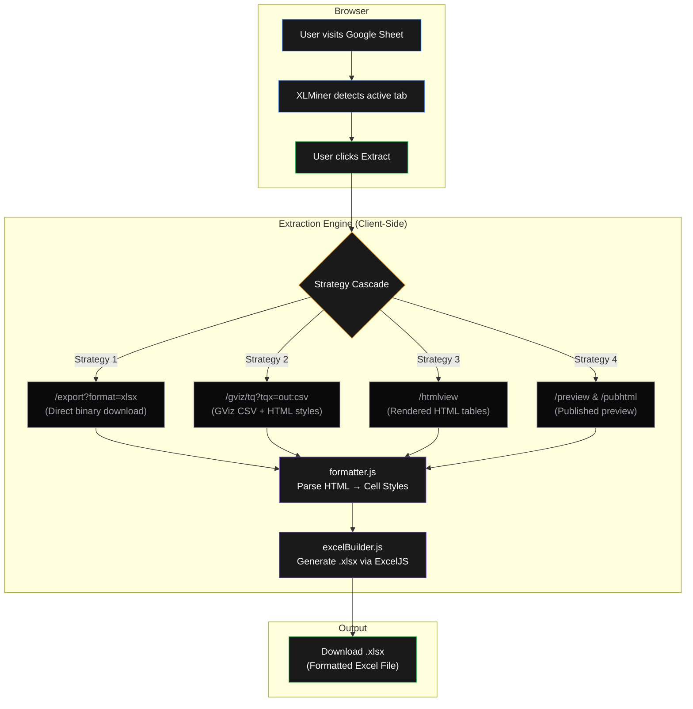
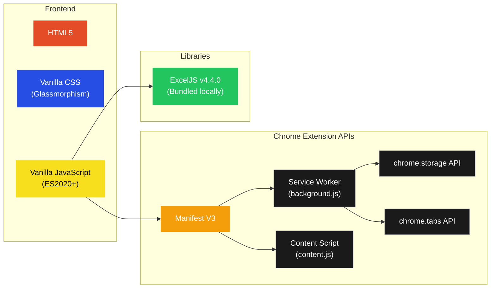

<p align="center">
  
</p>

<h1 align="center">XLMiner</h1>

<p align="center">
  A lightweight Chrome Extension to extract and download Google Sheets as fully formatted Excel files — even when the download option is disabled by the document owner.
</p>

<p align="center">
  <a href="https://github.com/SudiptaSanki/XLMiner/blob/main/LICENSE"></a>
  <a href="https://github.com/SudiptaSanki/XLMiner/issues"></a>
  
  
</p>

---

## How It Works

XLMiner runs entirely inside your browser. When you navigate to a Google Sheet and click the extension icon, it automatically detects the active spreadsheet, extracts the data through Google's own endpoints, and reconstructs a native `.xlsx` Excel file — preserving fonts, colors, borders, merged cells, and column widths.



### Tech Stack



---

## Key Features

| Feature | Description |
|---|---|
| **Bypass Download Restrictions** | Extract spreadsheet data even when "Download, print, and copy" is disabled by the owner. |
| **Preserve Formatting** | Retains cell fills, font weights, italic styles, font sizes, text alignment, borders, and merged ranges. |
| **Automatic Tab Detection** | Detects the active Google Sheet in your browser automatically — no URL pasting needed. |
| **Multi-Sheet Support** | Detects and lists all sheet tabs within a workbook for selective extraction. |
| **100% Client-Side** | All processing happens locally in your browser. No data is sent to any external server. |
| **Page Overlay** | Optional floating button on Google Sheets pages for quick access. Fully toggleable. |
| **Large Sheet Handling** | Auto-scrolls to the download section for datasets with 10,000+ rows. |

---

## Installation Guide

### Prerequisites

| Requirement | Details |
|---|---|
| **Browser** | Google Chrome (version 116 or later recommended) |
| **OS** | Windows, macOS, or Linux |
| **Dependencies** | None — XLMiner has zero external dependencies. Everything is bundled. |

### Step 1: Download the Extension

**Option A — Clone with Git:**
```bash
git clone https://github.com/SudiptaSanki/XLMiner.git
```

**Option B — Download ZIP:**
1. Go to [github.com/SudiptaSanki/XLMiner](https://github.com/SudiptaSanki/XLMiner).
2. Click the green **"Code"** button → **"Download ZIP"**.
3. Extract the ZIP to a folder on your computer (e.g. `D:\XLMiner`).

### Step 2: Enable Developer Mode in Chrome

1. Open Google Chrome.
2. Type `chrome://extensions/` in the address bar and press Enter.
3. In the top-right corner, find the **"Developer mode"** toggle and turn it **ON**.

> **Note:** Developer mode is required to load unpacked extensions. This is a standard Chrome feature and does not affect browser security.

### Step 3: Load the Extension

1. On the `chrome://extensions/` page, click **"Load unpacked"** (top-left).
2. Browse to the `XLMiner` folder you cloned or extracted (the folder containing `manifest.json`).
3. Click **Select Folder**.
4. XLMiner will appear in your extensions list with its icon.

### Step 4: Pin to Toolbar (Recommended)

1. Click the **puzzle piece icon** (Extensions) in Chrome's toolbar.
2. Find **XLMiner** in the dropdown.
3. Click the **pin icon** next to it to keep it visible in the toolbar.

### Step 5: Start Extracting

1. Navigate to any Google Sheet in your browser.
2. Click the **XLMiner icon** in the toolbar.
3. The extension will automatically detect the active spreadsheet.
4. Click **"Extract Sheet"** — done!

---

## Usage

### Automatic Extraction
1. Open any Google Sheet (even one with downloads disabled).
2. Click the XLMiner toolbar icon.
3. The popup shows "**Sheet Detected**" with the document name.
4. Press **"Extract Sheet"** → watch the progress log → download the `.xlsx`.

### Page Overlay
- On first visit to a Google Sheet, XLMiner asks if you want to enable a floating quick-access button.
- You can enable/disable the overlay anytime using the **"Page overlay"** toggle at the bottom of the popup.

### Manual URL
- If the extension doesn't detect a sheet, click **"Paste custom URL"** and enter any Google Sheets link manually.

---

## Project Structure

```
XLMiner/
├── manifest.json            # Chrome Extension manifest (Manifest V3)
├── index.html               # Extension popup HTML
├── CONTRIBUTING.md           # Contribution guidelines
├── LICENSE                   # MIT License
├── README.md                 # This file
│
├── css/
│   ├── styles.css            # Popup styles (pure black glassmorphism)
│   └── content-inject.css    # Styles injected into Google Sheets pages
│
├── js/
│   ├── app.js                # Popup controller, UI logic, overlay toggle
│   ├── background.js         # Service worker (CORS-free fetch, popup opener)
│   ├── content.js            # Content script (overlay, permission prompt)
│   ├── extractor.js          # 4-strategy extraction pipeline & URL parser
│   ├── formatter.js          # HTML → cell style parser (fonts, colors, merges)
│   ├── excelBuilder.js       # ExcelJS-based .xlsx workbook generator
│   └── exceljs.min.js        # Bundled ExcelJS library (v4.4.0)
│
├── assets/
│   ├── logo.png              # Project logo (transparent background)
│   ├── icon128.png           # Extension icon 128×128 (transparent)
│   ├── icon48.png            # Extension icon 48×48
│   ├── icon32.png            # Extension icon 32×32
│   └── icon16.png            # Extension icon 16×16
│
└── server/                   # Optional Node.js CORS proxy (standalone web use)
    ├── proxy.js
    └── package.json
```

---

## Privacy & Data Handling

> **XLMiner processes all data entirely within your browser.**

- No spreadsheet data, URLs, or personal information is transmitted to any external server.
- The extension only communicates with Google's own servers (`docs.google.com`) to retrieve the spreadsheet data — the same servers your browser already connects to when you view the sheet.
- No analytics, tracking, telemetry, or data collection of any kind is included.
- The source code is fully open and auditable.

---

## Disclaimer

> **⚠️ Educational Purpose Only**

XLMiner is developed strictly as an **educational and research tool** to demonstrate browser extension capabilities and spreadsheet data processing techniques.

- This tool is intended **only** for extracting data from spreadsheets that you have **legitimate and authorized viewing access** to.
- Users are solely responsible for ensuring their use of this tool complies with all applicable laws, regulations, terms of service, and data protection policies.
- The developers of XLMiner are **not responsible** for any misuse, unauthorized data access, privacy violations, copyright infringement, or any damages arising from the use of this tool.
- **Respect data owners' privacy and intellectual property.** Do not use this tool to circumvent access controls on data you are not authorized to access or download.
- By using XLMiner, you acknowledge and accept full responsibility for your actions.

---

## Contributing

We welcome contributors of all skill levels! Whether you want to fix a bug, add a feature, improve documentation, or port to another browser — your help is appreciated.

**Read the full guide:** [CONTRIBUTING.md](CONTRIBUTING.md)

Quick start:
```bash
git clone https://github.com/SudiptaSanki/XLMiner.git
cd XLMiner
# Load as unpacked extension in chrome://extensions/
# Make changes → reload extension → test → submit PR
```

---

## License

Distributed under the [MIT License](LICENSE).
